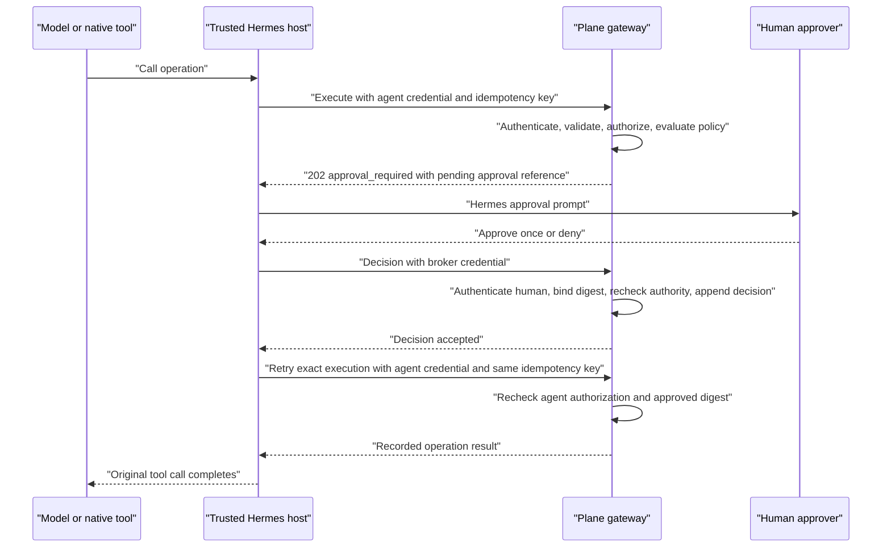

# Plane Agent Operation Approval Protocol

## Status

The user accepted Hermes as the approval UX and trusted decision broker on 2026-07-29. Exact approver eligibility, effect-policy defaults, and credential issuance remain proposed and must be frozen in the release manifest before implementation.

## Boundary

Plane owns operation authorization, approval policy, pending-attempt state, decision validation, and audit evidence.

Hermes owns the live human interaction and holds a separate Plane approval-broker credential in trusted host state.

The following principals are distinct:

- the Plane agent identity authenticates operation execution;
- the Plane human identity bound to the broker credential submits an approval decision;
- model-written TypeScript has neither credential;
- the ordinary agent credential cannot submit approval decisions;
- the broker credential cannot execute catalog operations.

Approval never expands the agent identity's Plane permissions.

## Minimal same-turn flow



Hermes keeps the original tool call blocked for at most the approved five-minute wait. The model does not receive an intermediate `approval_required` tool result and does not have to generate a second call.

## Plane endpoints

Operation execution remains:

```text
POST /api/v1/workspaces/{workspace_slug}/agent-operations/execute/
```

The approval broker uses one additional endpoint:

```text
POST /api/v1/workspaces/{workspace_slug}/agent-operation-approvals/{approval_id}/decision/
```

The execution endpoint accepts only the Plane agent credential. The decision endpoint accepts only a Plane approval-broker credential. Credential-type mismatch fails before object lookup.

Proposed decision request:

```json
{
  "decision": "approve_once",
  "attempt_id": "...",
  "operation": "plane.release_plans.create@1",
  "input_digest": "sha256:..."
}
```

An explicit denial may use `"decision": "deny"` and include a bounded human reason. The client repeats the server-provided attempt, operation, and digest so Plane can reject a stale or misbound prompt. The broker cannot replace any value or submit revised operation input.

## Pending approval state

Plane creates the pending record only after successful authentication, schema validation, reference resolution, Plane authorization, idempotency claim, and approval-policy evaluation.

The durable record binds:

- an opaque approval ID;
- server attempt ID;
- authenticated agent identity;
- workspace and resolved object IDs;
- operation major version and catalog digest;
- normalized input digest and mutation idempotency key;
- approval effect and bounded human summary;
- creation and expiry timestamps;
- state: `pending`, `approved`, `denied`, `expired`, or `consumed`.

The approval ID is an opaque correlation reference, not an authorization capability. Possessing it is insufficient without the separate broker credential.

The human-facing summary is generated from the validated normalized operation, not from arbitrary model text. It includes the operation, target project, material effects, and object counts without exposing inaccessible data.

## Decision and resume rules

- Only `approve_once` and `deny` are supported for Plane operation prompts in v1.
- Hermes's existing `session` and `always` dangerous-command choices do not apply to Plane operations.
- The first valid terminal decision wins. Repeating the same decision is idempotent; a different later decision returns `decision_conflict`.
- An expired, consumed, mismatched, or unknown approval never executes an operation.
- Decision acceptance rechecks the approver's current workspace status and the approved eligibility rule.
- Execution resume rechecks the agent identity's live Plane authorization, current catalog compatibility, approval-policy requirement, attempt expiry, and exact input digest.
- Approval is consumed atomically with mutation admission. It cannot authorize a second invocation.
- A changed input, operation, catalog major, workspace, actor, or idempotency key requires a new attempt and new approval.
- Denial and expiry are terminal for that attempt. The agent may propose a genuinely new operation through a new invocation.
- A transport loss after mutation admission follows the gateway idempotency and reconciliation rules; Hermes never converts it into a blind retry.

## Hermes reuse and required extension

Hermes already provides a per-session FIFO approval queue, a live `approval.request` UI, a blocking same-turn wait, a five-minute configurable timeout, connector prompt routing, and fail-closed cleanup when a session ends.

V1 reuses that interaction lifecycle but adds a typed Plane approval entry with:

- immutable `approval_id`, `attempt_id`, operation, digest, effect, summary, and expiry;
- choices limited to approve once or deny;
- a trusted callback that submits the decision with the broker credential;
- completion only after Plane accepts the decision;
- an exact execution retry using the original agent credential and idempotency key.

Plane approvals must not reuse Hermes's in-memory dangerous-command pattern allowlist. A local Hermes queue event is not proof that Plane accepted a human decision.

## Restart and concurrency

- If Hermes or the disposable run container stops while waiting, the original run fails closed.
- Plane may retain the pending record until its normal expiry for audit, but a restarted run cannot adopt or resume it.
- A late decision for a dead Hermes run may record denial, but approval is rejected once the bound broker session is revoked or the attempt expires.
- Concurrent independent operations have independent approval IDs and may continue according to the accepted sibling-concurrency rule.
- One curated semantic operation, such as release-plan creation, produces at most one approval prompt for its complete validated effect.
- V1 does not interpret an approval of one FIFO entry as approval of every waiting entry.

## Audit evidence

Plane appends separate linked events for:

1. operation attempted;
2. authorization evaluated;
3. approval requested;
4. approval decision accepted, denied, expired, or rejected;
5. agent authorization rechecked;
6. mutation admitted or withheld;
7. operation result or reconciliation outcome.

Decision evidence records the authenticated approver's Plane user ID, broker credential ID, decision, timestamp, attempt and input digests, and a bounded redacted reason. It never stores the credential or connector secret.

## Required negative controls

- Agent credential calls the decision endpoint.
- Broker credential calls the execution endpoint.
- Generated code attempts either endpoint or reads either credential.
- Approval ID is guessed, replayed, swapped across workspaces, or paired with a different digest.
- Approver loses eligibility before decision acceptance.
- Agent loses authorization before execution resume.
- Approval expires during the decision request.
- Two approvers race with matching and conflicting decisions.
- Hermes dies after prompt, after decision acceptance, and during resumed execution.
- The decision response is lost and safely repeated.
- A session or permanent Hermes command approval is presented as a Plane operation approval.

Every negative control must prove zero unauthorized mutation and complete audit evidence.

## Open freeze decisions

1. Define exactly which Plane humans are eligible to approve an agent operation.
2. Define which approval effects prompt by default and which policy overrides administrators may configure.
3. Define issuance, storage, rotation, revocation, and connector binding for broker credentials.
