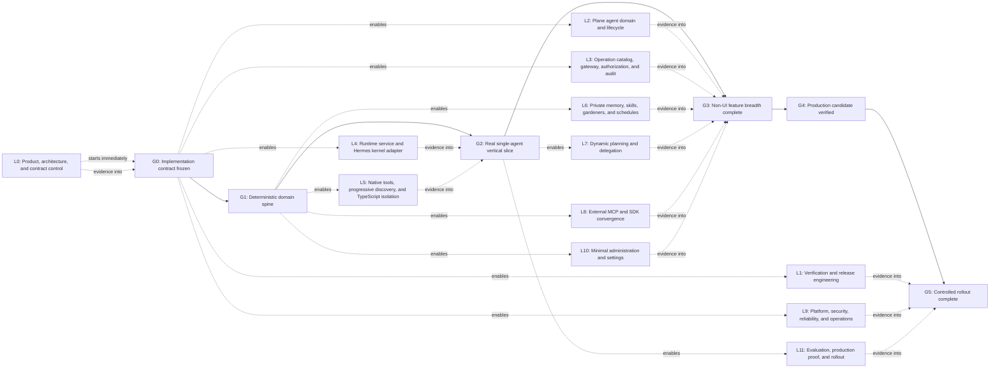

<!-- Generated by verifiers/render-non-ui-implementation-plan.mjs from NON-UI-IMPLEMENTATION-PLAN.json. Do not edit by hand. -->

# Plane Agent non-UI implementation overview

## Status

Accepted delivery coordination overlay; implementation gated by explicit manifest approval

This is a delivery coordination overlay. The ADRs, architecture, decision register, and approved manifests remain normative when they disagree with this overview.

## Outcome

Finish the Plane Agent system end to end without building chat UI. Plane owns the product and durable control state; the hidden execution kernel runs behind a narrow runtime service; every supported operation/action converges on the Plane Operation Gateway; and the exact release is independently verifiable and operable in production.

The system is operated through API, CLI, fixtures, and minimal reused settings surfaces until chat UX is designed later.

## Scope boundary

Included:

- Plane-owned Agent identity, profiles, exactly-one-role governance, assignments, runs, invocations, outcomes, conversations, artifacts, agent-private memory, skills, schedules, dynamic delegation, evaluator review, authorization, and audit
- Plane Operation Gateway, semantic operation catalog, native tools, progressive discovery, TypeScript composition, and external MCP convergence
- Separate Plane agent-runtime service backed by the hidden execution kernel
- Security isolation, reliability, observability, evaluation, release, and controlled rollout
- API, CLI, fixtures, operator surfaces, and minimal settings administration needed to configure and verify the system

Excluded:

- Chat, composer, inbox, thread, sidecar, transcript, and conversation-navigation UI
- A custom agent design system or custom settings framework
- A second authorization system, direct agent database access, or ambient credentials in generated code

**UI rule:** No chat UI is required. Minimal settings UI may be added only by extending Plane's existing settings routes, forms, tables, modals, services, state, and @plane/ui components. API and test harnesses come first.

## Working principles

1. Reuse a proven Plane, Hermes, Buzz, MCP, SDK, or platform mechanism before writing a replacement.
2. New production code is allowed only at a Plane-owned domain seam, cross-process contract, security boundary, or missing compatibility adapter.
3. Build generators, fixtures, contract tests, and verification entry points before broad hand-written expansion.
4. Optimize each phase for the final architecture; do not add temporary compatibility layers merely to keep every intermediate state smooth.
5. Integrate at explicit gates. No runtime, application, or verification implementation starts before explicit APPROVAL-MANIFEST.md approval and G0; every gate must be reproducible and green.

## How a traditional company would run it

1. **Approve the contract and staff the lanes.** A product/technical lead closes ownership and trust-boundary decisions, names accountable owners, and obtains the explicit implementation approval already required by the manifest.
2. **Build four foundations in parallel.** Plane domain, Operation Gateway, runtime service, and verification engineering work from shared generated contracts and fixtures.
3. **Integrate a deterministic slice before adding a model.** The fake runtime proves the complete assignment-to-outcome lifecycle and operation path without UI or model variability.
4. **Replace only the fake adapter with real Hermes.** Native tools, progressive discovery, Code Mode, context projections, and host callbacks fill the already-tested runtime contract.
5. **Prove one real assigned outcome.** The first real vertical slice is the forcing function for lifecycle, authorization, mutation safety, publication, isolation, and audit.
6. **Expand breadth after the spine holds.** Private memory, skills, schedules, dynamic delegation, MCP convergence, reused settings surfaces, and operational hardening proceed in parallel without changing the core ownership model.
7. **Verify the release artifact, then roll out progressively.** Clean-checkout verification, retained live evaluation, canaries, observability, credential drills, and rollback precede each cohort expansion.

Teams integrate at the gates below, not by keeping every branch continuously compatible. A lane may be temporarily incomplete between gates, but it must not introduce throwaway compatibility layers that survive into the target architecture.

## Execution map

The dotted lane edges show when work starts and the gate by which its evidence must be complete. L9 remains continuous after G0; every other lane follows its declared gate and no implementation lane starts before G0.

## Lane summary

| Lane | Responsibility | Accountable owner | Starts after | Complete by |
| ---- | -------------- | ----------------- | ------------ | ----------- |
| L0 | Product, architecture, and contract control | Product/technical lead | Now | G0 |
| L1 | Verification and release engineering | Quality/release owner | G0 | G5 |
| L2 | Plane agent domain and lifecycle | Plane backend/domain owner | G0 | G3 |
| L3 | Operation catalog, gateway, authorization, and audit | Plane API/platform owner | G0 | G3 |
| L4 | Runtime service and Hermes kernel adapter | Agent runtime/Hermes owner | G0 | G2 |
| L5 | Native tools, progressive discovery, and TypeScript isolation | Runtime security/tooling owner | G1 | G2 |
| L6 | Private memory, skills, gardeners, and schedules | Knowledge/automation owner | G1 | G3 |
| L7 | Dynamic planning and delegation | Delegation/domain owner | G2 | G3 |
| L8 | External MCP and SDK convergence | SDK/integrations owner | G1 | G3 |
| L9 | Platform, security, reliability, and operations | Infrastructure/security owner | G0 | G5 |
| L10 | Minimal administration and settings | Plane web/settings owner | G1 | G3 |
| L11 | Evaluation, production proof, and rollout | Quality/product/operations gate owners | G2 | G5 |

## Integration gates

| Gate | Meaning | Representative exit condition |
| ---- | ------- | ----------------------------- |
| G0 | Implementation contract frozen | ADR-0008, ADR-0009, and ADR-0010 are accepted before their implementation lanes; the approval manifest is explicitly approved before any runtime, application, or verification implementation starts. |
| G1 | Deterministic domain spine | A fixture can create an agent actor, profile version, assignment, run snapshot, invocation, and terminal outcome without a model or UI. |
| G2 | Real single-agent vertical slice | A real forked-Hermes process completes the assigned planning outcome through native tools and progressive TypeScript composition. |
| G3 | Non-UI feature breadth complete | Full Plane integration/action coverage, private memory/skills, schedules, dynamic delegation, artifacts, evaluator review, and outcome APIs satisfy their accepted contracts. |
| G4 | Production candidate verified | The clean-checkout primary verifier passes static, contract, authorization, isolation, mutation, compatibility, load, recovery, and operator checks. |
| G5 | Controlled rollout complete | After verification, development, allowlisted-workspace, expanded-cohort, and approved general-availability stages have recorded evidence and approval even though there are no current users. |

### G0: Implementation contract frozen

- ADR-0008, ADR-0009, and ADR-0010 are accepted before their implementation lanes; the approval manifest is explicitly approved before any runtime, application, or verification implementation starts.
- Runtime transport, event schemas, catalog names, limits, retention, idempotency, and audit failure policy are frozen for v1.
- UI-dependent and stale docs/search/execute verification language is reconciled with the non-UI boundary and current catalog decision.
- APPROVAL-MANIFEST.md receives the user's explicit implementation approval.
- Owners and repositories are assigned, and the cross-repository integration-lock format is agreed.

### G1: Deterministic domain spine

- A fixture can create an agent actor, profile version, assignment, run snapshot, invocation, and terminal outcome without a model or UI.
- The deterministic runtime adapter crosses the same dispatch and event-ingress contracts intended for Hermes.
- Pilot reads and one semantic mutation cross the gateway with live authorization, idempotency, bounded results, and append-only audit.
- Contract fixtures are generated once and pass in Plane and the runtime service.

### G2: Real single-agent vertical slice

- A real forked-Hermes process completes the assigned planning outcome through native tools and progressive TypeScript composition.
- The runtime publishes exactly one visible terminal product event through Plane APIs; raw model text is only run-inspection evidence.
- Authorized work succeeds, inaccessible project access is denied without leakage, stable replay creates no duplicate mutation, and credentials remain host-only.
- The entire slice is operable and verifiable through API, CLI, and fixtures with no chat UI.

### G3: Non-UI feature breadth complete

- Full Plane integration/action coverage, private memory/skills, schedules, dynamic delegation, artifacts, evaluator review, and outcome APIs satisfy their accepted contracts.
- HR proposes Agent creation, change, and retirement; workspace administrators approve each proposal; and every human has one mandatory chief-of-staff Agent restricted to that human's live permissions.
- Gardener application is automatic, versioned, and rollback-capable across sessions while strict per-Agent walls prevent knowledge from being copied between Agents.
- The approved external MCP inventory is migrated or explicitly dispositioned through the shared gateway.
- Minimal administration uses existing Plane settings primitives and introduces no chat UI or parallel design system.
- All supported behaviors have contract, permission, failure, and compatibility tests.

### G4: Production candidate verified

- The clean-checkout primary verifier passes static, contract, authorization, isolation, mutation, compatibility, load, recovery, and operator checks.
- The mandatory live pilot and retained evaluation suite meet approved thresholds with no provider/model fallback.
- Integration locks, artifacts, migrations, observability, runbooks, kill switches, credential lifecycle, retention, and rollback evidence are complete.

### G5: Controlled rollout complete

- After verification, development, allowlisted-workspace, expanded-cohort, and approved general-availability stages have recorded evidence and approval even though there are no current users.
- Production canaries prove one permitted and one denied Plane scenario, audit correlation, version readback, and rollback readiness.
- No unresolved security-critical failure, duplicate mutation, missing audit event, credential disclosure, or sandbox escape remains; automated safety stops are mandatory at every stage.

## Parallel delivery lanes

### L0: Product, architecture, and contract control

**Accountable owner:** Product/technical lead

**Window:** Immediately → G0

**Can progress alongside:** L1

**Outcome:** The team has one approved, internally consistent contract and a named definition of done before implementation begins.

Work:

- Record the accepted role, privacy, dynamic-planning, runtime, and trust-boundary decisions and every remaining decision that can change the first contract.
- Freeze the pilot operation catalog, model-facing presentation, runtime transport, event taxonomy, limits, retention, and failure semantics.
- Reconcile current manifests with the no-chat-UI boundary and remove stale fixed tool names.
- Assign accountable owners, review authorities, milestones, and change-control rules.

Reuse first:

- docs/agent-tooling decision register, manifests, contracts, fixtures, and ADRs
- Existing Plane and Hermes source inventories
- The local Freeform Plane-runner board as non-normative discovery input

Unavoidable custom seams:

- None; this lane changes contracts and generated planning artifacts only.

Completion evidence:

- Approved ADR statuses
- Approved implementation manifest
- Validated plan and integration-lock schema

### L1: Verification and release engineering

**Accountable owner:** Quality/release owner

**Window:** G0 → G5

**Can progress alongside:** L0, L2, L3, L4, L5, L6, L7, L8, L9, L10, L11

**Outcome:** Every lane produces rerunnable evidence, and one clean-checkout command proves the integrated system rather than relying on manual confidence.

Work:

- Build schema/catalog/runtime generators and shared golden fixtures before broad implementation.
- Implement contract, permission, fault, negative-control, live-evaluation, and evidence-index harnesses incrementally.
- Keep the cross-repository integration lock and release provenance current.
- Make each gate a CI entry point and make the final verifier aggregate all required checks.

Reuse first:

- Plane pytest and contract-test infrastructure
- Hermes pytest fixtures and fake providers
- Existing agent-tooling evaluation fixtures, manifests, and verifiers
- Buzz golden-transcript and fake-LLM patterns as reference donors

Unavoidable custom seams:

- Cross-repository contract generator
- Primary verifier and evidence index
- Deterministic runtime fake

Completion evidence:

- Gate-specific CI jobs
- Qualified negative controls
- Content-addressed evidence index

### L2: Plane agent domain and lifecycle

**Accountable owner:** Plane backend/domain owner

**Window:** G0 → G3

**Can progress alongside:** L1, L3, L4, L10

**Outcome:** Plane durably owns independently versioned actors, exactly-one-role profiles, assignments, runs, invocations, outcomes, conversations, artifacts, evaluator review, and human decision state.

Work:

- Add the minimal Django models, migrations, application services, serializers, and API endpoints for the accepted lifecycle.
- Persist immutable run snapshots and per-dispatch invocation envelopes, including cumulative budgets and Plane-owned input events.
- Enforce legal transitions, terminal-event synthesis, cancellation, blocker representation, revision, recovery, evaluator review, and outcome_unknown reconciliation.
- Implement HR proposals for Agent creation, change, and retirement, with workspace-administrator approval for each proposal.
- Automatically provision one mandatory chief-of-staff Agent per human within that human's live permissions and expose API/CLI fixtures for assignment, dispatch, inspection, outcome submission, evaluator review, accept, and revise.

Reuse first:

- Plane Django model, serializer, view, migration, background-task, and API conventions
- Existing Plane users, memberships, roles, object permissions, API tokens, activities, assets, and feature flags
- Existing notification/activity machinery where its semantics fit

Unavoidable custom seams:

- Plane Agent domain models and application service
- Run/invocation state machine
- Outcome review API

Completion evidence:

- Domain invariant tests
- Migration tests
- API contract tests
- Lease-death terminal-event tests

### L3: Operation catalog, gateway, authorization, and audit

**Accountable owner:** Plane API/platform owner

**Window:** G0 → G3

**Can progress alongside:** L1, L2, L4, L10

**Outcome:** Every supported Plane integration/action, native tool, TypeScript callback, runtime lifecycle mutation, and migrated MCP handler shares one typed, authorized, idempotent, bounded, audited Plane operation path.

Work:

- Generate the base catalog from supported OpenAPI and apply a curated semantic overlay.
- Implement the request-bound gateway around existing Plane application services rather than copying business logic.
- Add caller authentication—dedicated Agent identity for internal paths and authenticated human/integration identity for external MCP—plus live authorization, invocation idempotency, reconciliation, result shaping, structured errors, and append-only audit.
- Implement the v1 semantic planning operation and complete the full supported Plane integration/action catalog before G3.

Reuse first:

- Plane /api/v1 authentication and authorization
- Existing Plane application services and public OpenAPI generation
- Existing API token/OAuth paths, pagination, serializers, and domain permission checks
- Pinned MCP inventory and Plane Python SDK transport seam

Unavoidable custom seams:

- Operation Gateway application boundary
- Curated catalog overlay and generator
- Invocation idempotency/audit records

Completion evidence:

- Authorization matrix
- Three-entry-path trace tests
- Audit completeness tests
- Idempotency and reconciliation tests

### L4: Runtime service and Hermes kernel adapter

**Accountable owner:** Agent runtime/Hermes owner

**Window:** G0 → G2

**Can progress alongside:** L1, L2, L3, L5, L6, L9

**Outcome:** A separately deployed runtime service executes versioned Plane invocations through one narrow adapter while Hermes remains hidden and replaceable.

Work:

- Implement the cross-process dispatch, lease, cancellation, event-ingress, and checkpoint contract first against the deterministic fake.
- Add the narrow plane_runtime.execute adapter inside the runtime service; keep AIAgent imports behind it.
- Map Hermes transcripts, usage, progress, questions, artifacts, failures, and exits into bounded observations and gateway-correlated product events.
- Support safe continuation across replacement processes/containers without making Hermes sessions authoritative.

Reuse first:

- Hermes run_agent.py, agent/agent_init.py, gateway/session.py, gateway/profile_routing.py
- Hermes agent/tool_executor.py, bounded_response.py, and transcript/checkpoint mechanisms
- Buzz ACP pool, observer, steering, and runtime-isolation patterns as reference donors only

Unavoidable custom seams:

- Separate runtime service shell
- Versioned Plane runtime adapter
- Durable dispatch/event-ingress adapter

Completion evidence:

- Cross-process contract tests
- Restart/continuation tests
- Forged/duplicate event tests
- Real Hermes adapter tests

### L5: Native tools, progressive discovery, and TypeScript isolation

**Accountable owner:** Runtime security/tooling owner

**Window:** G1 → G2

**Can progress alongside:** L1, L4, L6, L9, L10

**Outcome:** Agents can efficiently use eager Plane tools and compose deferred operations in restricted TypeScript without receiving credentials or ambient authority.

Work:

- Build thin native adapters from generated operation contracts and register the approved eager Plane work core.
- Reuse Tool Search for long-tail disclosure and keep availability separate from authorization.
- Implement the restricted child TypeScript isolate, generated client, credential-free host RPC, and cumulative budgets.
- Prove network, filesystem, subprocess, package, credential, replay, sibling-process, and confused-deputy denial.

Reuse first:

- Hermes tools/tool_search.py, agent/tool_executor.py, middleware, concurrency, and tool-call IDs
- Hermes tools/code_execution_tool.py as a host-RPC and credential-scrubbing donor, not as the TypeScript runtime
- Hermes output limit, spill, and bounded-read mechanisms

Unavoidable custom seams:

- Plane TypeScript runner
- Credential-free callback binding
- Generated TypeScript operation client

Completion evidence:

- Sandbox probe matrix
- Catalog disclosure tests
- Nested authorization/audit traces
- Output and budget boundary tests

### L6: Private memory, skills, gardeners, and schedules

**Accountable owner:** Knowledge/automation owner

**Window:** G1 → G3

**Can progress alongside:** L1, L4, L5, L7, L10

**Outcome:** Plane governs agent-private context, memory, skills, gardeners, and schedule definition/control while automatically applying versioned, rollback-capable gardener revisions across sessions behind strict per-Agent walls; the hidden execution kernel supplies reusable retrieval, learning, skill, and scheduling mechanisms behind adapters.

Work:

- Implement agent-private typed scopes, provenance, visibility, retention, immutable revisions, rollback, and deterministic context assembly.
- Generate lossless MEMORY.md, subject-bound USER.md, and skill-package projections without treating files as the source of truth.
- Apply versioned, rollback-capable gardener revisions automatically across sessions while keeping every memory and skill change scoped to one target behind strict per-Agent walls; never copy knowledge between Agents.
- Own schedule definition and control state in Plane, then trigger due schedules into normal assignments and runs through the same run contract.

Reuse first:

- Hermes agent/memory_provider.py, context_engine.py, tools/memory_tool.py
- Hermes skills_tool.py, skill_manager_tool.py, skills_sync_client.py
- Hermes cron/scheduler.py, cron/jobs.py, and cronjob_tools.py as execution donors
- Plane pages/assets/rich-text and permission machinery where semantics fit

Unavoidable custom seams:

- Plane gardener governance records and projection adapters
- Deterministic context assembler
- Immutable revision, rollback, and retention policy enforcement

Completion evidence:

- Scope/leakage matrix
- Projection round-trip tests
- Gardener privacy, revision, and rollback tests
- Schedule recovery tests

### L7: Dynamic planning and delegation

**Accountable owner:** Delegation/domain owner

**Window:** G2 → G3

**Can progress alongside:** L1, L6, L8, L10, L11

**Outcome:** Plane supports case-specific dynamic planning, normal delegated assignments, recorded rationale, and delegation lineage after the single-agent lifecycle is proven, without a saved workflow-definition product.

Work:

- Implement the dedicated delegator role's case-specific planning.
- Automatically assign unclaimed work to humans or agents through normal assignment contracts.
- Record the rationale for every automatic assignment.
- Persist delegation lineage with scope, budgets, authorization, completion, and failure semantics.

Reuse first:

- Plane assignment/run lifecycle
- Hermes tools/delegate_tool.py and agent/subagent_lifecycle.py as execution donors
- Existing assignment mechanisms as the canonical Plane lifecycle; no workflow-definition donor is required

Unavoidable custom seams:

- Plane dynamic-plan/delegation domain records
- Delegated assignment policy adapter

Completion evidence:

- Dynamic-plan rationale and replay-safety tests
- Delegation lineage and budget tests
- Authorization and cancellation tests

### L8: External MCP and SDK convergence

**Accountable owner:** SDK/integrations owner

**Window:** G1 → G3

**Can progress alongside:** L1, L7, L9, L10, L11

**Outcome:** The supported Python MCP surface remains compatible while incrementally routing approved operations through the same Plane gateway, with the full supported action inventory covered or explicitly dispositioned.

Work:

- Add the optional gateway transport at the shared Plane Python SDK BaseResource seam.
- Map all pinned MCP operations to gateway operations, composed operations, retained local behavior, or approved deprecation.
- Migrate handlers incrementally with shadow comparison and rollback rather than rewriting the server.
- Pin compatible Plane, Hermes, MCP, SDK, and contract digests in the integration lock.

Reuse first:

- external/plane-mcp-server handlers and FastMCP host
- external/plane-python-sdk resources and BaseResource transport
- Existing 177-tool inventory and mapping contracts

Unavoidable custom seams:

- Optional SDK gateway transport
- Mapping/conformance generator
- Shadow comparison harness

Completion evidence:

- Per-tool disposition coverage
- Representative real-client tests
- Schema transition and rollback tests

### L9: Platform, security, reliability, and operations

**Accountable owner:** Infrastructure/security owner

**Window:** G0 → G5

**Can progress alongside:** L1, L4, L5, L8, L10, L11

**Outcome:** The runtime can be safely operated, observed, limited, upgraded, killed, recovered, and rolled back in production.

Work:

- Package the co-located runtime service and invocation-scoped isolation with leases, quotas, cancellation, cleanup, and replacement.
- Implement credential issue/store/rotate/revoke, redaction, retention, feature flags, and mutation/Code Mode kill switches.
- Add metrics, traces, alerts, audit lookup, incident runbooks, load/soak testing, disaster recovery, and rollback.
- Run threat modeling and security review continuously rather than as a final-stage audit.

Reuse first:

- Plane deployment, worker, feature-flag, authentication, logging, and monitoring conventions
- Hermes process/container runtime and per-profile environment isolation
- Existing infrastructure providers and secrets management

Unavoidable custom seams:

- Invocation supervisor/lease reconciliation
- Agent-runtime deployment unit
- Agent-specific operational dashboards and controls

Completion evidence:

- Threat model
- Load/soak report
- Credential drill
- Lease-death recovery
- Rollback rehearsal

### L10: Minimal administration and settings

**Accountable owner:** Plane web/settings owner

**Window:** G1 → G3

**Can progress alongside:** L1, L2, L3, L5, L6, L7, L8, L9, L11

**Outcome:** Administrators can configure and inspect roles, agents, HR proposals, gardeners, schedules, evaluators, limits, and kill switches through Plane's existing settings architecture, while all agent execution remains operable without UI.

Work:

- Keep API and CLI administration complete before adding pages.
- Add only settings entries required for actors, exactly-one-role profiles, credentials, HR proposals, operation availability/presentation, private memory/skill governance, schedules, evaluators, limits, and kill switches.
- Reuse existing settings layouts, headers, forms, tables, drawers/modals, services, stores, permissions, and @plane/ui components.
- Do not build message lists, composers, conversation navigation, transcript viewers, or a custom agent UI framework.

Reuse first:

- apps/web workspace/project settings routes and layouts
- packages/services API-token and settings service patterns
- packages/shared-state, packages/types, packages/constants, packages/i18n, and @plane/ui

Unavoidable custom seams:

- Thin agent-settings pages and service bindings only where no existing settings screen can be extended

Completion evidence:

- API parity tests
- Permission tests
- Basic settings smoke tests
- UI reuse review with no new design system

### L11: Evaluation, production proof, and rollout

**Accountable owner:** Quality/product/operations gate owners

**Window:** G2 → G5

**Can progress alongside:** L1, L7, L8, L9, L10

**Outcome:** The exact release artifact meets the approved full-coverage, functional, security, reliability, compatibility, operational, and rollout thresholds with immutable evidence.

Work:

- Run the mandatory real Plane Agent planning acceptance through API/CLI readback and ordinary Plane object pages, not chat UI.
- Execute the retained scenario matrix, including denials, retries, outcome_unknown, large results, hostile code, concurrency, and recovery.
- Qualify verifier negative controls, pin artifacts/digests, and run repeated clean-state final verification.
- Verify full Plane integration/action coverage, then promote through development, allowlisted workspace, expanded cohort, and approved GA with canary, safety-stop, and rollback evidence even though there are no current users.

Reuse first:

- Existing EVALUATION-SCENARIOS, manifests, planning fixtures, and RESULT evidence structure
- Plane API/pytest readback and existing object UI for non-chat verification
- Hermes real-provider harness and subscription-backed openai-codex route

Unavoidable custom seams:

- Live trial runner and immutable ledger
- Production canary/readback
- Release evidence aggregator

Completion evidence:

- Retained trial ledger
- Primary verifier result
- Signed/content-addressed provenance
- Rollout approvals and canary readbacks

## Reuse-first decision rule

Before approving new production code, the lane owner records:

1. The Plane, Hermes, Buzz, MCP, SDK, or platform mechanism inspected.
2. Why direct reuse or a thin adapter does not satisfy the accepted contract.
3. The narrowest new seam that closes that gap without duplicating business logic or ownership.
4. The contract test or verifier that proves the seam and prevents parallel implementations.
5. The ADR update required if the seam changes an accepted ownership or trust boundary.

Buzz remains a reference/code donor, not a production authority. Hermes remains an execution donor, not the Plane Agent product. Existing Plane application services remain the only place for Plane business behavior.

## Definition of finished

“Finished except chat UI” means G5 passes. It does not mean only that the model can call a tool. The completed system must have the full Plane-owned lifecycle, the hidden-kernel-backed runtime, TypeScript isolation, private governed knowledge, schedules, dynamic delegation, full Plane integration/action coverage, MCP compatibility, production operations, retained verification evidence, and controlled rollout with mandatory safety stops even though there are no current users. Chat/composer/thread UX remains a separate future program.
