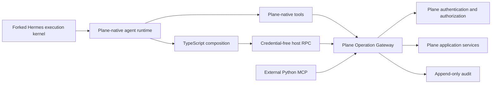

# Target Architecture

## System view



## Supported operation contract

The shared contract is a catalog of stable semantic operations. It is the only supported agent-facing path into Plane application behavior.

The catalog base is generated from Plane's supported public OpenAPI surface. A curated overlay supplies agent-oriented descriptions, examples, aliases, safety metadata, result policies, idempotency metadata, and direct-tool promotion metadata. Agent-native operations may be added when no appropriate public API operation exists. Private UI/session routes are not automatically agent-facing.

Every operation defines:

- Stable operation ID and version.
- Typed input and output schemas.
- Structured error codes.
- Pagination and filtering behavior where applicable.
- Authorization context requirements.
- Idempotency support and retry behavior.
- Per-result limit and large-result behavior.
- Audit redaction rules.

Catalog visibility is global. Discovering an operation does not imply permission to execute it.

## Plane Operation Gateway

The gateway initially lives inside the Plane API service. It is a boundary around existing Plane application services, not a second business-logic implementation.

Cross-process callers use one versioned JSON HTTP adapter under Plane's existing `/api/v1` service. The adapter reuses current API-key and OAuth authentication. Hermes native tools, the credential-free Code Mode host callback, and the official Python SDK transport converge on the same request-bound gateway module below that wire seam.

For every operation it:

1. Authenticates the dedicated Plane agent identity.
2. Validates the operation and input schema.
3. Evaluates current workspace membership, project role, object permissions, and other Plane authorization.
4. Applies idempotency and concurrency controls.
5. Invokes Plane application services.
6. Shapes and limits the returned result.
7. Appends correlated audit evidence.

Native tools, Code Mode callbacks, and external MCP handlers all cross this boundary. No path receives direct database access.

## Identity and credentials

Each Plane-native agent has a dedicated Plane identity and one revocable Plane credential. Hermes holds the credential in trusted host state and sends it on gateway calls. Plane derives the acting identity from the credential; a model-supplied identity is never authoritative.

The initial architecture does not mint run-bound capability tokens or per-operation credentials. Plane's existing authorization remains the sole entitlement system. `run_id`, `tool_call_id`, and invocation ID are correlation and idempotency metadata, not authorization capabilities.

Generated TypeScript never receives the Plane credential.

## Plane Agent domain ownership

Plane keeps three layers explicit:

1. The agent actor identity owns the durable Plane principal, credential, memberships, roles, and object permissions. These facts are the sole entitlement source and are not versioned as behavioral profile content.
2. A behavioral profile version owns persona, role, instructions, model/runtime defaults, skill and context references, memory scopes, and default tool-presentation choices. A run pins the resolved version.
3. Tool availability comes from installed and enabled Plane features and integrations. Tool disclosure chooses which available schemas are eager or progressive. Neither layer grants or denies Plane operations.

The minimum durable relationships have independent lifecycles:

```text
Agent actor -> Profile version
Assignment contract -> target + objective + acceptance + assignee
Run attempt -> assignment + resolved profile/context/tool/runtime snapshot
Runtime invocation -> one kernel dispatch within a run
Outcome submission -> run + artifacts + summary/evidence + review
```

An assignment is the commission to produce an outcome, not the outcome itself. A Plane run may span multiple Hermes sessions, invocations, processes, or restarts. Plane owns the durable conversation and history throughout.

## Plane-native runtime profile

The fork does not expose the `hermes-cli` personality or default 54-tool core as the Plane agent's product surface. A fresh agent begins with Plane identity, role, assignment, current object and conversation context, relevant knowledge, available operations, tool-presentation defaults, and runtime policy.

The model-facing catalog is designed from natural Plane workflows. Every run starts with a small universal Plane work core, then adds eager tools relevant to the agent profile and current assignment. Long-tail Plane operations, external connectors, browser, files, terminal, and specialist integrations may remain available while their schemas are progressively disclosed. The exact universal core is the next open catalog decision.

The universal core has one `search_workspace` discovery primitive. It returns typed references across Plane object types. Specialized searches remain discoverable for workflows that require domain-specific filters or projections; they do not compete in every agent's initial context.

Hermes supplies the hidden execution mechanisms for the model loop, context management, tool dispatch, transcript capture, concurrency, and bounded results. Plane owns the durable product concepts and authoritative state for identity, profiles, assignments, runs, conversations, memory, skills, schedules, delegation, artifacts, and outcomes. Reused Hermes subsystems sit behind Plane adapters when they support those concepts; Hermes-specific work systems and operational tools remain hidden.

Definitions and control state for memory, skills, schedules, workflows, and delegation remain in Plane. Hermes may execute those mechanisms behind adapters. Plane-governed storage remains authoritative; `MEMORY.md`, subject-bound `USER.md`, skill packages, and other files are lossless run projections rather than the source of truth. Automatic learning may produce agent-scoped candidates, but promotion into shared scopes is governed.

Native adapters remain thin:

- Validate the local tool contract.
- Attach trusted execution correlation.
- Call the Plane Operation Gateway.
- Return structured gateway results.

They do not reproduce Plane authorization or business logic.

## Proposed Plane runtime contract

ADR-0010 proposes one versioned logical runtime contract across a durable cross-process seam to a separate co-located agent-runtime service. The queue or RPC transport remains open. Plane persists an immutable run snapshot and creates a separate invocation envelope for each kernel dispatch. Human answers and other new context remain Plane-owned events referenced by the envelope, while cumulative run budgets cannot reset across invocations. Inside the runtime service, one `plane_runtime.execute` adapter invokes the kernel through a trusted host, validates observations defensively, and transmits them across the cross-process seam. Plane ingress revalidates and maps them into product state. Plane API modules never import the adapter or `AIAgent`; Hermes sessions, profile directories, registry globals, provider clients, and transport details do not cross the logical contract.

A runtime invocation maps to one visible Plane product event: outcome submission, waiting-for-input question, failure or blocker, or cancellation. Kernel final text is not automatically a conversation message. A conversation message requires an explicit agent publication action through an authorized, idempotent, audited Plane semantic operation. Runtime events are untrusted observations until Plane ingress revalidates host binding, identity, schema, sequence, limits, receipts, and legal state transitions. If invocation infrastructure dies first, Plane derives the terminal failure/cancellation from authoritative lease state. Intentional messages and compact activity receipts appear in conversation; detailed model/tool transcript remains in the run-inspection surface.

Recoverable invocation failures may continue the same Plane run when safe. `outcome_unknown` is reconciled or escalated and is never blindly replayed. A fresh run follows terminal failure/cancellation or human-requested revision.

Execution leases and containers belong to runtime invocations, not runs. A long-waiting run may release them and later recreate invocation infrastructure from Plane-owned snapshots, events, permitted checkpoints, and remaining budget.

## TypeScript composition surface

The Plane-native profile retains progressive capability discovery and one self-hosted TypeScript composition path. Its final tool names are not yet frozen. Bare `docs`, `search`, and `execute` are rejected because they collide with company knowledge, web, files, connectors, and Hermes's existing code-execution concepts.

TypeScript executes inside the disposable container assigned to one runtime invocation. A restricted child isolate has no Plane credentials, ambient environment secrets, arbitrary network, package installation, subprocess creation, or unrelated filesystem access. Its only Plane capability is a credential-free RPC callback to trusted host code.

Every inner callback traverses Hermes's normal tool middleware and the Plane Operation Gateway. Inner calls therefore retain authorization, audit, result limits, and tool-call correlation.

## Autonomous execution and concurrency

Agents execute autonomously within the live permissions of their dedicated Plane identity. An authorized operation proceeds immediately. An unauthorized operation returns a non-leaking denial. V1 has no runtime human-confirmation state, approval credential, pending approval, or same-turn approval resume protocol.

An explicitly declared operation group may be preflighted as a group before concurrent dispatch. Preflight performs schema, reference, authorization, budget, and concurrency validation only. It never emits a prompt, pending state, decision token, or resume requirement. Group execution uses per-operation outcomes rather than pretending to be transactional.

## Mutation safety

Supported mutations accept a stable invocation or idempotency key where Plane can provide safe replay semantics.

- A known failed operation may be retried according to its contract.
- A known successful operation returns the recorded result.
- An indeterminate non-idempotent operation returns `outcome_unknown`.
- `outcome_unknown` is never retried blindly.

## Results and artifacts

Model-visible results are always bounded. Normal results return structured data directly. Oversized results return a preview and a temporary artifact reference that existing read tools can inspect in bounded ranges.

After a temporary artifact expires, durable audit retains the redacted intent, affected object IDs, outcome, result hash, and bounded summary rather than the full bulky payload.

Exact thresholds and retention periods remain configuration decisions.

## Audit and replay evidence

Each attempted operation records:

- Acting Plane identity.
- Hermes run, turn, tool call, and invocation identifiers.
- Operation ID and contract version.
- Validated arguments or a redacted digest.
- Authorization decision.
- Affected object identifiers.
- Outcome, structured error code, and latency.
- Result hash and bounded summary.

Audit is append-only. Audit evidence supports investigation and reconciliation; it does not imply that arbitrary side effects can be replayed.

## Versioning

Audit and execution metadata pin exact catalog, source schema, TypeScript runtime, and adapter digests. Additive schema evolution is preferred. Breaking behavior requires an explicit compatibility and migration decision.

The external MCP compatibility surface is versioned independently from native tool ergonomics, while both resolve to the shared operation contract.

## Reuse from the Hermes kernel

Reuse:

- Native tool registry and Tool Search.
- Tool-call identifiers and middleware hooks.
- Concurrent execution and ordered result projection.
- Session transcript persistence.
- Oversized-result spill and bounded previews.
- Gateway run events.

Extend only where Plane requires:

- TypeScript rather than Hermes's current Python Code Mode runtime.
- Plane operation catalog adapters.
- Plane identity credential injection in trusted host callbacks.
- Plane authorization, idempotency, and audit integration.
- Stronger child-isolate restrictions for Plane Code Mode.
