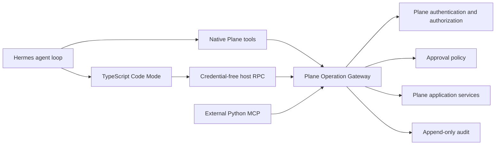

# Target Architecture

## System view

## Supported operation contract

The shared contract is a catalog of stable semantic operations. It is the only supported agent-facing path into Plane application behavior.

The catalog base is generated from Plane's supported public OpenAPI surface. A curated overlay supplies agent-oriented descriptions, examples, aliases, safety metadata, result policies, idempotency metadata, and direct-tool promotion metadata. Agent-native operations may be added when no appropriate public API operation exists. Private UI/session routes are not automatically agent-facing.

Every operation defines:

- Stable operation ID and version.
- Typed input and output schemas.
- Structured error codes.
- Pagination and filtering behavior where applicable.
- Authorization context requirements.
- Approval-risk metadata.
- Idempotency support and retry behavior.
- Per-result limit and large-result behavior.
- Audit redaction rules.

Catalog visibility is global. Discovering an operation does not imply permission to execute it.

## Plane Operation Gateway

The gateway initially lives inside the Plane API service. It is a boundary around existing Plane application services, not a second business-logic implementation.

For every operation it:

1. Authenticates the dedicated Plane agent identity.
2. Validates the operation and input schema.
3. Evaluates current workspace membership, project role, object permissions, and other Plane authorization.
4. Evaluates approval policy separately from authorization.
5. Applies idempotency and concurrency controls.
6. Invokes Plane application services.
7. Shapes and limits the returned result.
8. Appends correlated audit evidence.

Native tools, Code Mode callbacks, and external MCP handlers all cross this boundary. No path receives direct database access.

## Identity and credentials

Each Plane-native agent has a dedicated Plane identity and one revocable Plane credential. Hermes holds the credential in trusted host state and sends it on gateway calls. Plane derives the acting identity from the credential; a model-supplied identity is never authoritative.

The initial architecture does not mint run-bound capability tokens or per-operation credentials. Plane's existing authorization remains the sole entitlement system. `run_id`, `tool_call_id`, and invocation ID are correlation and idempotency metadata, not authorization capabilities.

Generated TypeScript never receives the Plane credential.

## Native Hermes tools

Common semantic operations are registered as native Hermes tools. Remaining supported operations are progressively discoverable through Hermes Tool Search and Code Mode.

Native adapters remain thin:

- Validate the local tool contract.
- Attach trusted execution correlation.
- Call the Plane Operation Gateway.
- Return structured gateway results.

They do not reproduce Plane authorization or business logic.

## Code Mode surface

Code Mode provides three model-facing tools:

- `docs` explains the programming model and common patterns.
- `search` finds supported operations and relevant schemas.
- `execute` runs model-written TypeScript that composes catalog operations.

TypeScript executes inside the disposable container assigned to the Hermes run. A restricted child isolate has no Plane credentials, ambient environment secrets, arbitrary network, package installation, subprocess creation, or unrelated filesystem access. Its only Plane capability is a credential-free RPC callback to trusted host code.

Every inner callback traverses Hermes's normal tool middleware and the Plane Operation Gateway. Inner calls therefore retain authorization, approval, audit, result limits, and tool-call correlation.

## Approval and concurrency

Hermes's existing approval lifecycle is reused:

- The run emits `approval.request`.
- The affected worker waits.
- Concurrent admitted siblings may continue.
- An approval response resumes the exact tool call in the same logical turn.
- Tool results remain paired with stable call IDs and are projected in model-call order.

Approval does not grant authorization the agent lacks.

If the Hermes process or run container dies while waiting, the run fails. Pending approval does not survive restart in the initial architecture. A later retry follows normal mutation-safety rules.

An explicitly declared operation group may be preflighted as a group before concurrent dispatch. Group execution uses per-operation outcomes rather than pretending to be transactional.

## Mutation safety

Supported mutations accept a stable invocation or idempotency key where Plane can provide safe replay semantics.

- A known failed operation may be retried according to its contract.
- A known successful operation returns the recorded result.
- An indeterminate non-idempotent operation returns `outcome_unknown`.
- `outcome_unknown` is never retried blindly.

## Results and artifacts

Model-visible results are always bounded. Normal results return structured data directly. Oversized results return a preview and a temporary artifact reference that existing read tools can inspect in bounded ranges.

After a temporary artifact expires, durable audit retains the redacted intent, affected object IDs, outcome, approvals, result hash, and bounded summary rather than the full bulky payload.

Exact thresholds and retention periods remain configuration decisions.

## Audit and replay evidence

Each attempted operation records:

- Acting Plane identity.
- Hermes run, turn, tool call, and invocation identifiers.
- Operation ID and contract version.
- Validated arguments or a redacted digest.
- Authorization decision.
- Approval decision and approver reference when applicable.
- Affected object identifiers.
- Outcome, structured error code, and latency.
- Result hash and bounded summary.

Audit is append-only. Audit evidence supports investigation and reconciliation; it does not imply that arbitrary side effects can be replayed.

## Versioning

Audit and execution metadata pin exact catalog, source schema, TypeScript runtime, and adapter digests. Additive schema evolution is preferred. Breaking behavior requires an explicit compatibility and migration decision.

The external MCP compatibility surface is versioned independently from native tool ergonomics, while both resolve to the shared operation contract.

## Reuse from Hermes

Reuse:

- Native tool registry and Tool Search.
- Tool-call identifiers and middleware hooks.
- Concurrent execution and ordered result projection.
- Live approval requests and same-turn continuation.
- Session transcript persistence.
- Oversized-result spill and bounded previews.
- Gateway run events and approval responses.

Extend only where Plane requires:

- TypeScript rather than Hermes's current Python Code Mode runtime.
- Plane operation catalog adapters.
- Plane identity credential injection in trusted host callbacks.
- Plane authorization, approval policy, idempotency, and audit integration.
- Stronger child-isolate restrictions for Plane Code Mode.
