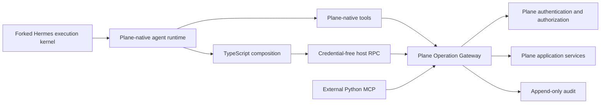

# Target Architecture

## System view

## Supported operation contract

The shared contract is a catalog of stable semantic operations. It is the only supported agent-facing path into Plane application behavior.

The catalog base is generated from Plane's supported public OpenAPI surface. A curated overlay supplies agent-oriented descriptions, examples, aliases, safety metadata, result policies, idempotency metadata, and direct-tool promotion metadata. Agent-native operations may be added when no appropriate public API operation exists. Private UI/session routes are not automatically agent-facing.

Every operation defines:

- Stable operation ID and version.
- Typed input and output schemas.
- Structured error codes.
- Pagination and filtering behavior where applicable.
- Authorization context requirements.
- Idempotency support and retry behavior.
- Per-result limit and large-result behavior.
- Audit redaction rules.

Catalog visibility is global. Discovering an operation does not imply permission to execute it.

## Plane Operation Gateway

The gateway initially lives inside the Plane API service. It is a boundary around existing Plane application services, not a second business-logic implementation.

Cross-process callers use one versioned JSON HTTP adapter under Plane's existing `/api/v1` service. The adapter reuses current API-key and OAuth authentication. Hermes native tools, the credential-free Code Mode host callback, and the official Python SDK transport converge on the same request-bound gateway module below that wire seam.

For every operation it:

1. Authenticates the dedicated Plane agent identity.
2. Validates the operation and input schema.
3. Evaluates current workspace membership, project role, object permissions, and other Plane authorization.
4. Applies idempotency and concurrency controls.
5. Invokes Plane application services.
6. Shapes and limits the returned result.
7. Appends correlated audit evidence.

Native tools, Code Mode callbacks, and external MCP handlers all cross this boundary. No path receives direct database access.

## Identity and credentials

Each Plane-native agent has a dedicated Plane identity and one revocable Plane credential. Hermes holds the credential in trusted host state and sends it on gateway calls. Plane derives the acting identity from the credential; a model-supplied identity is never authoritative.

The initial architecture does not mint run-bound capability tokens or per-operation credentials. Plane's existing authorization remains the sole entitlement system. `run_id`, `tool_call_id`, and invocation ID are correlation and idempotency metadata, not authorization capabilities.

Generated TypeScript never receives the Plane credential.

## Plane-native runtime profile

The fork does not expose the `hermes-cli` personality or default 54-tool core as the Plane agent's product surface. A fresh agent begins with Plane identity, role, assignment, current object and conversation context, relevant knowledge, enabled capabilities, and runtime policy.

The model-facing catalog is designed from natural Plane workflows. Common Plane actions are eager only when they are broadly useful and unambiguous. Long-tail Plane operations, external connectors, browser, files, terminal, and specialist capabilities may remain enabled while their schemas are progressively disclosed. The exact eager surface is the next open catalog decision.

Hermes remains responsible for execution, lifecycle, delegation, memory, skills, scheduling, tool dispatch, transcript persistence, concurrency, and bounded-result machinery beneath this profile. Hermes-specific work systems and operational tools are hidden or adapted when Plane already owns the corresponding product concept.

Native adapters remain thin:

- Validate the local tool contract.
- Attach trusted execution correlation.
- Call the Plane Operation Gateway.
- Return structured gateway results.

They do not reproduce Plane authorization or business logic.

## TypeScript composition surface

The Plane-native profile retains progressive capability discovery and one self-hosted TypeScript composition path. Its final tool names are not yet frozen. Bare `docs`, `search`, and `execute` are rejected because they collide with company knowledge, web, files, connectors, and Hermes's existing code-execution concepts.

TypeScript executes inside the disposable container assigned to the Hermes run. A restricted child isolate has no Plane credentials, ambient environment secrets, arbitrary network, package installation, subprocess creation, or unrelated filesystem access. Its only Plane capability is a credential-free RPC callback to trusted host code.

Every inner callback traverses Hermes's normal tool middleware and the Plane Operation Gateway. Inner calls therefore retain authorization, audit, result limits, and tool-call correlation.

## Autonomous execution and concurrency

Agents execute autonomously within the live permissions of their dedicated Plane identity. An authorized operation proceeds immediately. An unauthorized operation returns a non-leaking denial. V1 has no runtime human-confirmation state, approval credential, pending approval, or same-turn approval resume protocol.

An explicitly declared operation group may be preflighted as a group before concurrent dispatch. Preflight performs schema, reference, authorization, budget, and concurrency validation only. It never emits a prompt, pending state, decision token, or resume requirement. Group execution uses per-operation outcomes rather than pretending to be transactional.

## Mutation safety

Supported mutations accept a stable invocation or idempotency key where Plane can provide safe replay semantics.

- A known failed operation may be retried according to its contract.
- A known successful operation returns the recorded result.
- An indeterminate non-idempotent operation returns `outcome_unknown`.
- `outcome_unknown` is never retried blindly.

## Results and artifacts

Model-visible results are always bounded. Normal results return structured data directly. Oversized results return a preview and a temporary artifact reference that existing read tools can inspect in bounded ranges.

After a temporary artifact expires, durable audit retains the redacted intent, affected object IDs, outcome, result hash, and bounded summary rather than the full bulky payload.

Exact thresholds and retention periods remain configuration decisions.

## Audit and replay evidence

Each attempted operation records:

- Acting Plane identity.
- Hermes run, turn, tool call, and invocation identifiers.
- Operation ID and contract version.
- Validated arguments or a redacted digest.
- Authorization decision.
- Affected object identifiers.
- Outcome, structured error code, and latency.
- Result hash and bounded summary.

Audit is append-only. Audit evidence supports investigation and reconciliation; it does not imply that arbitrary side effects can be replayed.

## Versioning

Audit and execution metadata pin exact catalog, source schema, TypeScript runtime, and adapter digests. Additive schema evolution is preferred. Breaking behavior requires an explicit compatibility and migration decision.

The external MCP compatibility surface is versioned independently from native tool ergonomics, while both resolve to the shared operation contract.

## Reuse from the Hermes kernel

Reuse:

- Native tool registry and Tool Search.
- Tool-call identifiers and middleware hooks.
- Concurrent execution and ordered result projection.
- Session transcript persistence.
- Oversized-result spill and bounded previews.
- Gateway run events.

Extend only where Plane requires:

- TypeScript rather than Hermes's current Python Code Mode runtime.
- Plane operation catalog adapters.
- Plane identity credential injection in trusted host callbacks.
- Plane authorization, idempotency, and audit integration.
- Stronger child-isolate restrictions for Plane Code Mode.
